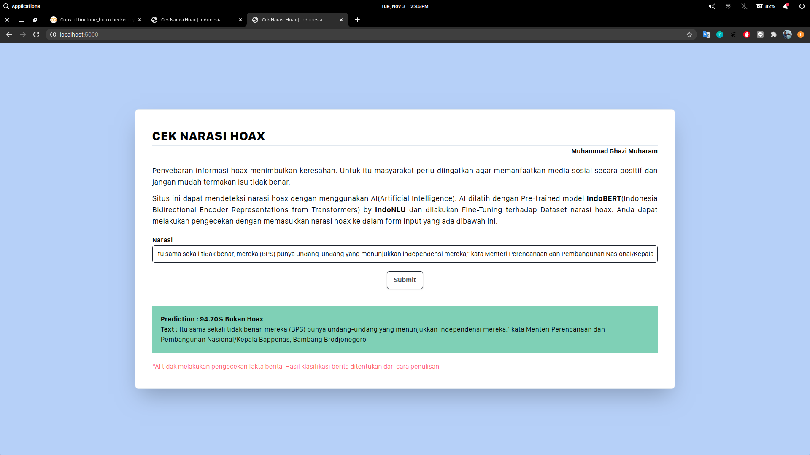
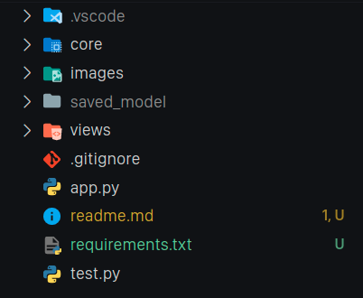

# Hoax Detection

This app can detect and classify a narration into hoax and not hoax label,the app use Flask for the web application framework and using BERT to classify the label.

Step to install

- clone the repo and navigate inside the repo

- `pip install -r requirements.txt`

- `python app.py`

Because of file limit, you have to manually download the fine-tuned model here
[Fine-tuned Model](https://drive.google.com/drive/folders/1-2xEC1wTfhbr5SUBrOur5NX5ocJQrjst?usp=sharing)

Here is the look of the complete repo

